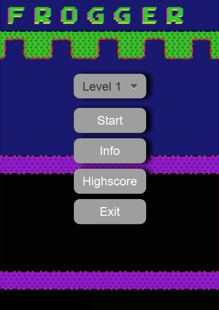
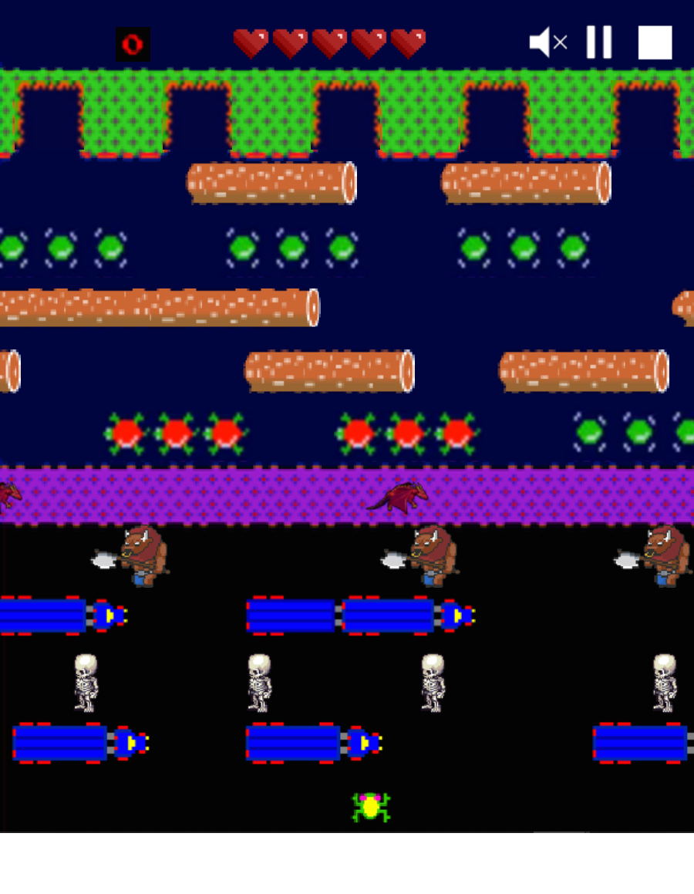

# COMP2042_CW_hcyab2

Name: Abhinav George Basil

Student ID: 20205163

OWA: hcyab2

## Key Changes Made for Maintenance and Extension

- Configured the file for Github to regularly push updated code to the respective repository for easier maintenance
  - On request, users can be added as a collaborator to view the repository
- Added JavaDocs for easier understanding
- Broke up classes into separate classes to give each class unique functionality
    - Created the Game class which focuses on initializing the game itself from the Main class
    - Created the AddObjects class which focuses on adding objects to the game from the Main class
- Renamed classes for easier understanding
  - Changed the Animal class to Frog
  - Changed the Obstacle class to Vehicles
- Added new classes to provide new functionality
    - The Highscore class helps with the functionality of the newly added high score menu
    - The Mute class helps add the option to mute the game with the click of a button
    - The Pause class helps pause the game by adding a pause button to the game itself
    - The stop class helps stop the game by adding a stop button to the game itself
    - The RoundScore class helps gather the scores for each round to be shown in the round score menu
    - The Skeleton, Dragon and Minotaur class to add new characters to the game
    - The PowerUp class to add a power up orb to the game
    - The RoundScore class was made to help with the functionality of the newly created round score pop-up menu
    - The lives class shows the number of lives left for the frog in the game itself
    - The ActorFactory class is used to configure the factory design pattern for the AddObjects class
- Converted many blocks of code into their own methods to improve readability
- Improved encapsulation of data by making the majority of the data-types private while using required getters and setters to protect data
- Added a new background and adjusted it to make the game look nicer
- Created a fully functioning start menu, info menu, high score menu and high score (round score) pop-up using FXML, CSS and Scenebuilder
- The factory design pattern has been utilized to add actors to the AddObjects class to enhance maintainability by introducing the ActorFactory class
- The code has been organized to adhere to the MVC Pattern making the project cleaner and easier to understand
- Added a permanent high score list which stores data to Highscore.csv to be used in the High score menu created with FXML and Scenebuilder
- 10 levels with different characters, speed and arrangements have been created to make the game more interesting
- The music has been changed to add a little more **_funk_**
- Utilized JUnit 5 to test the functionality of different areas of the program
- Utilized Maven to handle dependencies
- Used IntelliJ to create a class diagram
- All resources used in this project are free to use for non-commercial applications

- Main Menu:

- Level 10 of the Game:
